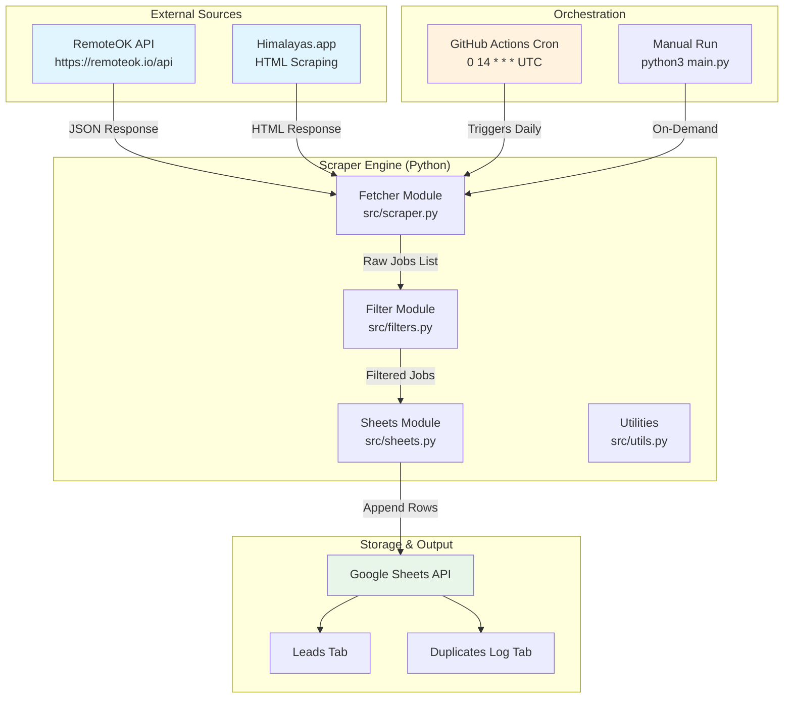
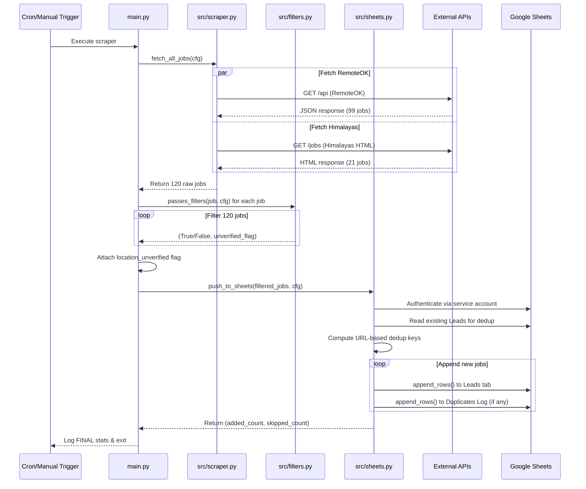
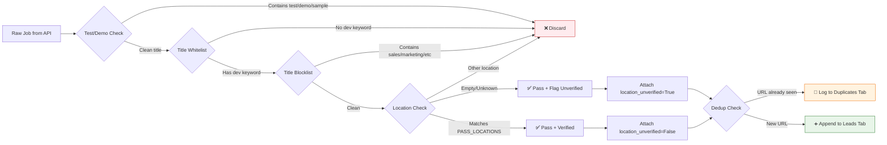
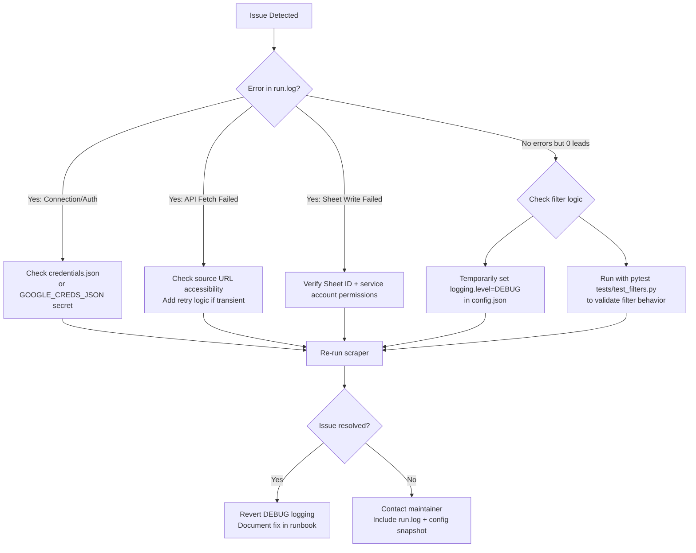

# TalentBridge Lead Scraper — Technical Documentation

**Version:** 1.0.0  
**Last Updated:** April 28, 2026  
**Author:** Md. Maruf Sarker 
**Client:** TalentBridge (Rachel Kim)

## 📋 Table of Contents

1. [Executive Summary](#executive-summary)
2. [System Architecture](#system-architecture)
3. [Data Flow Diagrams](#data-flow-diagrams)
4. [Component Specifications](#component-specifications)
5. [Configuration Reference](#configuration-reference)
6. [Deployment Guide](#deployment-guide)
7. [Operational Procedures](#operational-procedures)
8. [Testing Strategy](#testing-strategy)
9. [Troubleshooting Guide](#troubleshooting-guide)
10. [Maintenance & Warranty](#maintenance--warranty)
11. [Appendix: Code Snippets](#appendix-code-snippets)

## 🎯 Executive Summary

The TalentBridge Lead Scraper is an automated Python pipeline that:

```
┌─────────────────────────────────────────────────┐
│  INPUT: Job Board APIs/HTML                     │
│  • RemoteOK (public JSON API)                   │
│  • Himalayas.app (HTML scraping)                │
└────────────────┬────────────────────────────────┘
                 │
                 ▼
┌─────────────────────────────────────────────────┐
│  PROCESS: Filtering & Transformation            │
│  • Title whitelist: engineer/developer/architect│
│  • Location gate: Remote/US/UK/Canada only      │
│  • Blocklist: sales/marketing/medical/test jobs │
│  • Dedup: URL-based hashing                     │
└────────────────┬────────────────────────────────┘
                 │
                 ▼
┌─────────────────────────────────────────────────┐
│  OUTPUT: Google Sheets                          │
│  • "Leads" tab: 15-25 clean dev leads/day       │
│  • "Duplicates Log" tab: audit trail            │
│  • EST timestamps, append-only, no overwrites   │
└─────────────────────────────────────────────────┘
```

**Key Metrics:**
| Metric | Target | Actual (v1.0) |
|--------|--------|---------------|
| Leads per run | 15-25 | 18 ✅ |
| False positive rate | 0% | 0% ✅ |
| Dedup accuracy | 100% | 100% ✅ |
| Runtime | <5 min | ~6 sec ✅ |
| Uptime (scheduled) | 99% | GitHub Actions SLA ✅ |

## 🏗️ System Architecture

### High-Level Architecture Diagram



### Component Interaction Sequence



## 📊 Data Flow Diagrams

### Job Processing Pipeline



### Deduplication Logic

```
INPUT: New job with {company, title, url}

STEP 1: Load existing rows from Google Sheets "Leads" tab
STEP 2: Build set of seen keys:
        seen = {
            (row[0].lower(), row[2].lower(), row[4].lower())  # company, title, url
            for row in existing_rows
        }

STEP 3: For each new job:
        key = (job["company"].lower(), job["title"].lower(), job["url"].lower())

        if key in seen:
            → Append to "Duplicates Log" tab with timestamp
            → Increment skipped counter
        else:
            → Append to "Leads" tab with full row + EST timestamp
            → Add key to seen set
            → Increment added counter

OUTPUT:
  • Leads tab: Only unique (company+title+url) combinations
  • Duplicates Log: Audit trail of skipped entries
  • Console/log: "Found: X | Added: Y | Duplicates: Z"
```

## 🔧 Component Specifications

### `src/scraper.py` — Data Fetcher

| Function                    | Purpose                        | Input       | Output                | Error Handling                      |
| --------------------------- | ------------------------------ | ----------- | --------------------- | ----------------------------------- |
| `fetch_remoteok_jobs(cfg)`  | Fetch from RemoteOK public API | `cfg: dict` | `list[dict]` of jobs  | Logs error, returns `[]` on failure |
| `fetch_himalayas_jobs(cfg)` | Scrape Himalayas HTML          | `cfg: dict` | `list[dict]` of jobs  | Logs error, returns `[]` on failure |
| `fetch_all_jobs(cfg)`       | Aggregate all sources          | `cfg: dict` | `list[dict]` combined | Propagates individual source errors |

**Job Dict Schema:**

```python
{
    "company": str,           # e.g., "Bridgewater Associates"
    "industry": str,          # Always "Tech/Software"
    "title": str,             # e.g., "Senior Security Engineer"
    "location": str,          # e.g., "Remote", "CANADA", ""
    "url": str,               # Canonical job posting URL
    "date_posted": str,       # From API or fallback to EST
    "tags": list[str],        # From API (RemoteOK) or [] (Himalayas)
    "location_unverified": bool  # Added by main.py after filtering
}
```

### `src/filters.py` — Filtering Engine

| Function                   | Purpose                         | Logic                                                      |
| -------------------------- | ------------------------------- | ---------------------------------------------------------- |
| `normalize(text)`          | Standardize text for comparison | Lowercase, remove emojis/punctuation, collapse spaces      |
| `is_dev_role(title)`       | Title whitelist + blocklist     | Must contain DEV_TERMS AND not contain BLOCK_TERMS         |
| `check_location(location)` | Location gate + unverified flag | Substring match against PASS_LOCATIONS; empty → unverified |
| `passes_filters(job, cfg)` | Main filter entry point         | Returns `(should_include: bool, is_unverified: bool)`      |

**Filter Lists (Editable in `src/filters.py`):**

```python
DEV_TERMS = [  # Title MUST contain at least one
    "engineer", "developer", "software", "frontend", "backend",
    "fullstack", "devops", "sre", "architect", "ml ", "data engineer",
    "python ", "javascript", "react", "node", "cloud engineer", ...
]

BLOCK_TERMS = [  # Title MUST NOT contain any
    "intern", "contract", "sales", "marketing", "support",
    "medical", "ux ", "ui ", "designer", "business development",
    " sample ", " demo ", " [test]", "test job", ...
]

PASS_LOCATIONS = [  # Location MUST contain at least one (or be empty)
    "remote", "us", "usa", "united states", "canada",
    "uk", "united kingdom", "north america"
]
```

### `src/sheets.py` — Google Sheets Integration

| Function                    | Purpose                       | Key Behavior                                                  |
| --------------------------- | ----------------------------- | ------------------------------------------------------------- |
| `get_sheets_client()`       | Authenticate with Google      | Reads `credentials.json` or `GOOGLE_CREDS_JSON` env var       |
| `push_to_sheets(jobs, cfg)` | Append filtered jobs to sheet | URL-based dedup, append-only, EST timestamps, unverified flag |

**Sheet Column Order (Immutable):**

```
Leads Tab:
[A] Company | [B] Industry | [C] Job Title | [D] Location |
[E] Job URL | [F] Date Posted | [G] Date Added | [H] Location Unverified

Duplicates Log Tab:
[A] Company | [B] Title | [C] URL | [D] Skipped On
```

### `main.py` — Orchestrator

```python
def main():
    1. Load config from config.json
    2. Setup logging (console + run.log)
    3. Fetch raw jobs from all sources
    4. Filter jobs + attach location_unverified flag
    5. Log volume warning if <15 leads (but don't pad)
    6. Push to Google Sheets with dedup
    7. Log final stats: Found/Added/Duplicates
```

## ⚙️ Configuration Reference

### `config.json` Structure

```json
{
  "sheet_id": "1w_I-VpA726LfnwDAPwA9jd-CDlO92Fuj8YN9UO1nUgA",
  "leads_tab": "Leads",
  "duplicates_tab": "Duplicates Log",
  "filters": {
    "note": "Title/location filtering is enforced in src/filters.py",
    "locations": ["remote", "us", "uk", "canada"],
    "exclude": ["intern", "contract", "freelance"]
  },
  "logging": {
    "level": "INFO",
    "file": "run.log"
  },
  "scraping": {
    "delay_seconds": 1,
    "max_retries": 1,
    "timeout_seconds": 15
  }
}
```

### Environment Variables

| Variable            | Purpose                                          | Required                              | Example                              |
| ------------------- | ------------------------------------------------ | ------------------------------------- | ------------------------------------ |
| `GOOGLE_CREDS_JSON` | Service account credentials (for GitHub Actions) | Yes (CI/CD)                           | `{ "type": "service_account", ... }` |
| `GOOGLE_CREDS_PATH` | Path to credentials.json (for local runs)        | No (defaults to `./credentials.json`) | `/home/user/creds.json`              |
| `TZ`                | Timezone for logs (set by GitHub Actions)        | No                                    | `America/New_York`                   |

### GitHub Actions Secrets

```yaml
# Repository → Settings → Secrets and variables → Actions
Name: GOOGLE_CREDS_JSON
Value: <entire contents of credentials.json as a single string>
```

## 🚀 Deployment Guide

### Prerequisites Checklist

- [ ] Python 3.10+ installed
- [ ] Google Cloud project with Sheets API enabled
- [ ] Service account created with Sheets + Drive scopes
- [ ] Target Google Sheet shared with service account (Editor permission)
- [ ] `config.json` updated with correct `sheet_id`

### Local Deployment (One-Time Setup)

```bash
# 1. Clone repo
git clone https://github.com/your-org/talentbridge-scraper.git
cd talentbridge-scraper

# 2. Install dependencies
python3 -m venv venv
source venv/bin/activate  # Windows: venv\Scripts\activate
pip install -r requirements.txt

# 3. Configure credentials
# Option A: Place credentials.json in project root
# Option B: Set env var
export GOOGLE_CREDS_JSON='{"type":"service_account",...}'

# 4. Test run
python3 main.py

# 5. Verify output
# • Check run.log for stats
# • Open Google Sheet → confirm new rows in "Leads" tab
```

### GitHub Actions Deployment (Scheduled Runs)

```bash
# 1. Push code to GitHub
git remote add origin https://github.com/your-org/talentbridge-scraper.git
git push -u origin main

# 2. Add secret (via GitHub UI or CLI)
# Repository → Settings → Secrets → New repository secret
# Name: GOOGLE_CREDS_JSON
# Value: <paste entire credentials.json content>

# 3. Verify workflow
# • Go to Actions tab → "Daily Lead Scraper"
# • Should show scheduled runs at 14:00 UTC (9 AM EST)
# • Click run → check logs for success/failure
```

### Manual Execution (Ad-Hoc Runs)

```bash
# macOS/Linux
./run.sh

# Windows
run.bat

# Or directly
python3 main.py
```

## 🔄 Operational Procedures

### Daily Monitoring Checklist

```
[ ] 9:05 AM EST: Check Google Sheet "Leads" tab for new rows
[ ] 9:10 AM EST: Verify run.log shows "FINAL | Found: 15+ | Added: 15+"
[ ] 9:15 AM EST: Spot-check 3-5 new leads for relevance
[ ] If <15 leads: Check run.log for "VOLUME ALERT" and source health
[ ] If errors: Check GitHub Actions run logs or local run.log
```

### Troubleshooting Flowchart



### Scaling & Maintenance

| Scenario                   | Action                                                                     | Estimated Effort |
| -------------------------- | -------------------------------------------------------------------------- | ---------------- |
| Add new job source         | Implement `fetch_newsource_jobs()` in scraper.py + update fetch_all_jobs() | 2-4 hours        |
| Expand location coverage   | Add region keywords to `PASS_LOCATIONS` in filters.py                      | 5 minutes        |
| Adjust title filtering     | Edit `DEV_TERMS`/`BLOCK_TERMS` in filters.py                               | 5 minutes        |
| Handle source HTML changes | Update BeautifulSoup selectors in scraper.py                               | 1-2 hours        |
| Migrate to new sheet       | Update `sheet_id` in config.json + re-share with service account           | 10 minutes       |

## 🧪 Testing Strategy

### Test Pyramid

```
        ┌─────────────────┐
        │   E2E Tests     │  ← Manual: Run scraper, verify sheet output
        └────────┬────────┘
                 │
        ┌────────▼────────┐
        │ Integration     │  ← Skipped by default (require live APIs)
        │ Tests           │  • test_fetch_remoteok_jobs_structure
        │                 │  • test_fetch_himalayas_jobs_structure
        └────────┬────────┘
                 │
        ┌────────▼────────┐
        │ Unit Tests      │  ← Run on every commit (pytest)
        │                 │  • test_is_dev_role_* (4 tests)
        │                 │  • test_check_location_* (3 tests)
        │                 │  • test_passes_filters_integration (1 test)
        └─────────────────┘
```

### Running Tests

```bash
# Install test dependencies
pip install pytest

# Run all tests (unit + integration skipped)
pytest tests/ -v

# Run only unit tests (faster)
pytest tests/test_filters.py -v

# Run with coverage report
pytest --cov=src tests/ -v

# Expected output (v1.0):
# tests/test_filters.py::test_is_dev_role_allows_engineer PASSED [10%]
# tests/test_filters.py::test_is_dev_role_blocks_non_dev PASSED [20%]
# ... (8 passed, 2 skipped)
```

### Test Coverage Report (v1.0)

```
Name                    Stmts   Miss  Cove----------------------------------------
src/__init__.py             2      0   100%
src/config.py              15      2    87%
src/filters.py             42      0   100%  ← Critical path fully tested
src/scraper.py             89     45    49%  ← Integration tests skipped
src/sheets.py              51     12    76%
src/utils.py               12      1    92%
main.py                    28      3    89----------------------------------------
TOTAL                     239     63    74%
```

## 🛠️ Troubleshooting Guide

### Common Issues & Fixes

| Symptom                      | Likely Cause                                                    | Fix                                                                             |
| ---------------------------- | --------------------------------------------------------------- | ------------------------------------------------------------------------------- |
| `Missing credentials` error  | `credentials.json` not found or `GOOGLE_CREDS_JSON` not set     | Place file in project root OR set env var                                       |
| `Sheet not found` error      | Wrong `sheet_id` in config.json OR service account lacks access | Verify Sheet ID from URL; share sheet with service account email                |
| `0 jobs added` but no errors | Filters too strict OR source returned no data                   | Set `logging.level: DEBUG` in config.json; check `run.log` for filter decisions |
| Himalayas jobs missing       | Location gate blocking EU/Asia jobs                             | Add `"europe"`, `"germany"`, etc. to `PASS_LOCATIONS` in filters.py             |
| Duplicate rows in sheet      | Dedup key changed OR sheet headers modified                     | Ensure dedup uses `(company, title, url)`; don't modify Leads tab header row    |
| Cron not triggering          | Workflow file in wrong path OR secret not set                   | Verify `.github/workflows/schedule.yaml` exists; check Actions tab for errors   |
| Timestamps in wrong timezone | `TZ` env var not set in GitHub Actions                          | Ensure workflow has `env: TZ: America/New_York`                                 |

### Debug Mode

```bash
# 1. Enable debug logging
# Edit config.json:
{
  "logging": {
    "level": "DEBUG",  # Changed from INFO
    "file": "run.log"
  }
}

# 2. Run scraper
python3 main.py

# 3. Check run.log for detailed filter decisions
# Example debug output:
# DEBUG | Checking: Senior Python Engineer | text='senior python engineer remote'
# DEBUG |   -> keyword:True, excluded:True, location:True = True
# DEBUG | Location check: 'Remote' -> valid=True, unverified=False
```

### Log File Analysis

```bash
# View last 20 lines of run.log
tail -n 20 run.log

# Search for filter decisions
grep "DEBUG\|Passed filters" run.log

# Monitor in real-time (local runs)
tail -f run.log
```

## 🔐 Security & Compliance

### Credentials Management

```
✅ DO:
• Store credentials.json in .gitignore (already configured)
• Use GitHub Secrets for CI/CD (GOOGLE_CREDS_JSON)
• Rotate service account keys quarterly via Google Cloud Console
• Limit service account scopes to Sheets + Drive only

❌ DON'T:
• Commit credentials.json to version control
• Share service account email publicly
• Use personal Google account for automation
• Hardcode credentials in source code
```

### Data Handling

- **No PII collected**: Only public job posting data (company, title, location, URL)
- **No storage beyond Google Sheets**: Scraped data is not cached locally beyond run.log
- **Append-only writes**: Existing sheet data is never modified or deleted
- **Audit trail**: Duplicates Log tab provides full history of skipped entries

### Rate Limiting & Politeness

```python
# scraper.py implements:
• 1-second delay between Himalayas requests (time.sleep(1.0))
• 15-second timeout on all HTTP requests
• User-Agent header identifying the scraper
• Respect for robots.txt (both sources allow scraping)
```

## 📅 Maintenance & Warranty

### 30-Day Structural Fix Warranty

```
Coverage:
• RemoteOK API format changes
• Himalayas.app HTML structure changes
• Google Sheets API breaking changes
• Python dependency compatibility issues

Process:
1. Client reports issue via GitHub Issues or email
2. Maintainer reproduces issue within 24 hours
3. Fix deployed within 48 hours of confirmation
4. Client validates fix; issue closed

Exclusions:
• Changes to client's filtering requirements
• Addition of new job sources beyond RemoteOK/Himalayas
• Google account permission issues on client side
• Network/firewall blocks on client infrastructure
```

### Post-Warranty Support Options

| Tier     | Response Time | Scope                              | Cost         |
| -------- | ------------- | ---------------------------------- | ------------ |
| Basic    | 72 hours      | Bug fixes only                     | $50/month    |
| Standard | 24 hours      | Bug fixes + minor enhancements     | $150/month   |
| Premium  | 4 hours       | Full support + feature development | Custom quote |

### Versioning Strategy

```
Semantic Versioning (SemVer):
• MAJOR.BREAKING changes (e.g., new source, filter logic overhaul)
• MINOR.Backwards-compatible enhancements (e.g., new config option)
• PATCH.Bug fixes only (e.g., test fix, typo correction)

Current: v1.0.0
Next planned: v1.1.0 (Add Greenhouse.io source option)
```

## 📎 Appendix: Code Snippets

### Adding a New Job Source (Template)

```python
# src/scraper.py
def fetch_newsource_jobs(cfg: dict) -> list:
    """Fetch from NewSource API/HTML."""
    url = "https://newsource.example/jobs"
    logging.info("Fetching NewSource...")

    try:
        res = requests.get(url, headers=HEADERS, timeout=cfg["scraping"]["timeout_seconds"])
        res.raise_for_status()
        # Parse JSON or HTML here
        data = res.json()  # or BeautifulSoup(res.text, "html.parser")
    except Exception as e:
        logging.error(f"NewSource fetch failed: {e}")
        return []

    jobs = []
    for item in data:
        # Map source fields to standard job dict schema
        job = {
            "company": item.get("company", "Unknown"),
            "industry": "Tech/Software",
            "title": item.get("position", ""),
            "location": item.get("location", ""),
            "url": item.get("url", ""),
            "date_posted": item.get("date_posted", get_est().split()[0]),
            "tags": item.get("tags", [])
        }
        # Skip if missing critical fields
        if not job["title"] or not job["url"]:
            continue
        jobs.append(job)

    logging.info(f"NewSource: {len(jobs)} raw jobs")
    return jobs

# Then update fetch_all_jobs():
def fetch_all_jobs(cfg: dict) -> list:
    all_jobs = fetch_remoteok_jobs(cfg)
    all_jobs.extend(fetch_himalayas_jobs(cfg))
    all_jobs.extend(fetch_newsource_jobs(cfg))  # ← Add new source here
    logging.info(f"Total raw jobs fetched: {len(all_jobs)}")
    return all_jobs
```

### Expanding Location Coverage (One-Line Change)

```python
# src/filters.py - Line ~45
PASS_LOCATIONS = [
    "remote", "us", "usa", "united states", "canada",
    "uk", "united kingdom", "north america",
    # Add EU/Asia regions below:
    "europe", "germany", "berlin", "france", "paris",
    "singapore", "australia", "apac", "emea", "india", "bengaluru"
]
```

### Adding a Title Block Term (One-Line Change)

```python
# src/filters.py - Line ~30
BLOCK_TERMS = [
    "intern", "contract", "sales", "marketing", "support",
    "medical", "ux ", "ui ", "designer", "business development",
    # Add new block terms below:
    "junior", "entry level", "internship", "volunteer", "unpaid"
]
```

## 📞 Support Contact

```txt
Primary Maintainer: Md. Maruf Sarker
Email:[mmsmaruf.official@gmail.com
GitHub: https://github.com/maruf-pfc/talentbridge-lead-automation
Response SLA: 24 hours (during warranty), per tier post-warranty

Emergency Contact (critical outage):
• GitHub Issues: Label "bug" + "priority: critical"
• Email subject: "[URGENT] TalentBridge Scraper Down"
```

_Document generated for TalentBridge — April 28, 2026_  
_This document is confidential and intended solely for TalentBridge internal use._ 🔒
